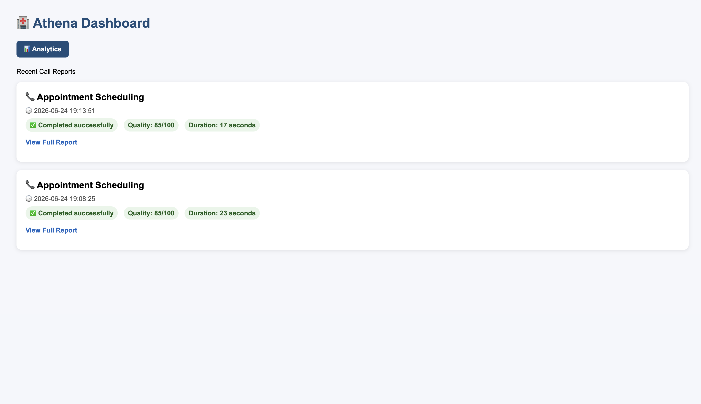
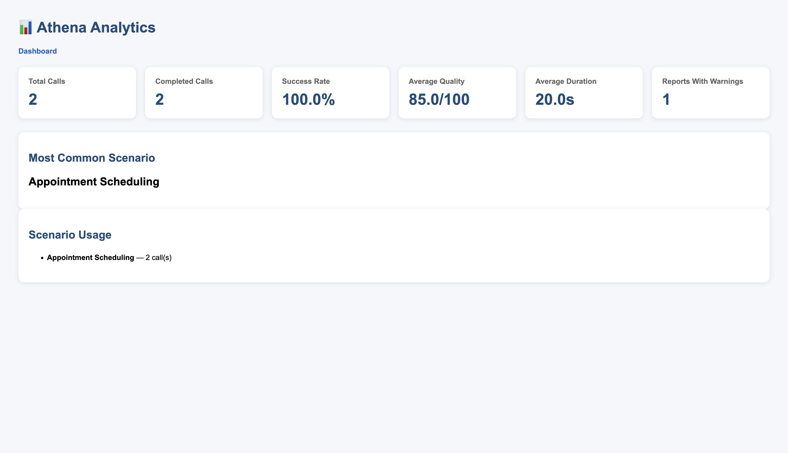
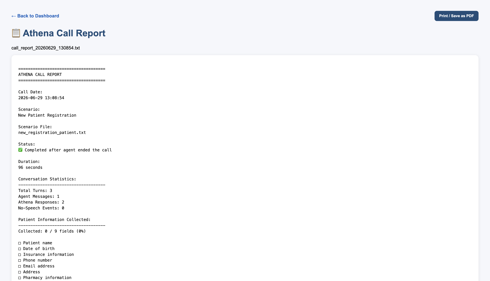

# Athena Voice Bot

AI-powered healthcare voice patient simulator built with **Python**, **Flask**, **Twilio Voice**, and **Google Gemini**.

Athena simulates realistic healthcare phone conversations for testing conversational AI, voice automation, and patient-service workflows. It supports multiple healthcare scenarios, automatic transcript generation, quality analysis, reporting, and a web dashboard for reviewing completed calls.

---

# Project Highlights

- AI-powered healthcare voice assistant
- Twilio Voice phone call integration
- Google Gemini conversational AI
- Speech-to-text and text-to-speech conversations
- Automatic transcript generation
- Interactive Dashboard
- Analytics Dashboard
- Automatic call reports
- SQLite-backed call storage
- Database-driven dashboard and analytics
- CSV export for call history
- Print-friendly PDF report export
- Call quality scoring
- Warning detection
- Multiple healthcare workflows

---

# Features

- Interactive healthcare voice conversations
- Six healthcare patient workflows
- Dynamic patient personas
- Command-line scenario selection
- Twilio outbound phone calls
- Flask webhook server
- Speech recognition
- Conversation memory
- Transcript logging
- Automatic report generation
- SQLite database integration
- Database-backed dashboard and analytics
- CSV call report export
- Print / Save as PDF report option
- HTML report viewer
- Analytics dashboard
- Call quality scoring
- Warning detection
- Mock mode for offline development
- Google Gemini integration
- Modular architecture

---

# Supported Voice Workflows

- Appointment Scheduling
- New Patient Registration
- Prescription Refill
- Insurance Update
- Appointment Cancellation
- Appointment Rescheduling

---

# Dashboard & Analytics

Athena includes a built-in web dashboard for monitoring completed calls.

### Dashboard

- Browse completed call reports
- View scenario information
- View quality scores
- View duration
- Open detailed HTML reports
- Print or save reports as PDF
- Export call history to CSV

### Analytics

- Total calls
- Completed calls
- Success rate
- Average quality score
- Average call duration
- Reports containing warnings
- Most common scenario
- Scenario usage statistics
- Scenario usage chart

---

# Architecture

```text
                 Phone Call
                      │
                      ▼
             Twilio Voice API
                      │
                      ▼
            Flask Webhook Server
                      │
        ┌─────────────┴─────────────┐
        │                           │
        ▼                           ▼
 Scenario Engine             Dashboard
 Patient Personas            Analytics
 Conversation Memory         Report Viewer
        │
        ▼
 Google Gemini AI
        │
        ▼
Speech Response Engine
Transcript Logging
Report Generation
```

---

# Project Structure

```text
athena-voice-bot/

├── scenarios/
│   ├── new_patient.txt
│   ├── refill_patient.txt
│   ├── insurance_patient.txt
│   ├── cancel_patient.txt
│   ├── reschedule_patient.txt
│   └── new_registration_patient.txt
│
├── reports/
├── transcripts/
│
├── templates/
│   ├── dashboard.html
│   ├── analytics.html
│   └── report.html
│
├── call_runner.py
├── twiml_server.py
├── database.py
├── patient.py
├── logger.py
├── summarizer.py
├── main.py
├── test_call.py
├── test_gemini.py
├── requirements.txt
├── ROADMAP.md
└── .env.example
```

---

# Installation

```bash
git clone https://github.com/dandrek123/athena-voice-bot.git

cd athena-voice-bot

python -m venv venv

source venv/bin/activate

pip install -r requirements.txt
```

---

# Environment Variables

Create a `.env` file.

```env
GEMINI_API_KEY=your_api_key_here

USE_MOCK_MODE=true

TWILIO_ACCOUNT_SID=your_account_sid
TWILIO_AUTH_TOKEN=your_auth_token

TWILIO_PHONE_NUMBER=+1000000000
TEST_TO_PHONE_NUMBER=+1000000000

VOICE_WEBHOOK_URL=https://your-ngrok-url.ngrok-free.app/voice
```

---

# Running Athena

Start the Flask server:

```bash
python twiml_server.py
```

Run a scenario:

```bash
python call_runner.py --scenario appointment
```

Available scenarios:

```bash
python call_runner.py --scenario appointment
python call_runner.py --scenario refill
python call_runner.py --scenario insurance
python call_runner.py --scenario cancel
python call_runner.py --scenario reschedule
python call_runner.py --scenario registration
```

---

# Automatic Report Generation

Every completed call automatically generates:

- Transcript
- Call duration
- Conversation statistics
- Patient information collected
- Quality score
- Warning detection
- Outcome summary

Reports are available through the Athena Dashboard.

---

# SQLite-Backed Reporting

Athena now stores completed call data in a local SQLite database.

The database stores:

- Scenario name
- Call status
- Quality score
- Duration
- Warning count
- Transcript text
- Outcome summary
- Report path
- Transcript path
- Timestamp

The dashboard and analytics pages read from SQLite, making call history easier to manage, analyze, and expand in future versions.

Local database files are ignored by Git using `.gitignore`.

---

# Dashboard Preview

## Dashboard



## Analytics



## HTML Report Viewer



---

# Example Conversation

```text
Athena:
Hello, this is Athena. I would like to schedule an appointment.

Agent:
What is your name?

Athena:
My name is Sarah Johnson.

Agent:
What day would you like to come in?

Athena:
Next Tuesday morning would work for me if you have availability.

Agent:
What insurance do you have?

Athena:
I have Blue Cross Blue Shield insurance.

Agent:
What is your date of birth?

Athena:
My date of birth is January tenth, nineteen ninety two.

Agent:
Anything else?

Athena:
No, that is all. Thank you.
```

---

# Technologies Used

- Python
- Flask
- Twilio Voice API
- Google Gemini API
- HTML
- CSS
- Jinja2
- Python Dotenv
- Speech Recognition
- Prompt Engineering
- REST Webhooks

---

# Current Capabilities

- Voice-based patient simulation
- Interactive speech conversations
- Multiple healthcare workflows
- Scenario-based patient personas
- Transcript generation
- Automatic report generation
- Dashboard and analytics
- Command-line scenario switching
- Mock mode for offline testing
- Modular architecture for future AI expansion
- SQLite-backed call history
- Database-driven dashboard and analytics
- CSV export for stored call reports
- Print-friendly PDF export for detailed reports
- Visual analytics chart for scenario usage

---

# Roadmap

- More interactive charts
- Advanced search and filter options
- Live Gemini conversations
- Recording management
- Additional healthcare workflows
- Multi-language conversations
- Advanced analytics charts
- Pretty Good AI Challenge submission

---

# Author

**D'Andre Knight**

Computer Science graduate focused on Software Engineering, Artificial Intelligence, Automation, Cybersecurity, and Voice AI.

GitHub: https://github.com/dandrek123

LinkedIn: www.linkedin.com/in/d’andre-knight-358836251
